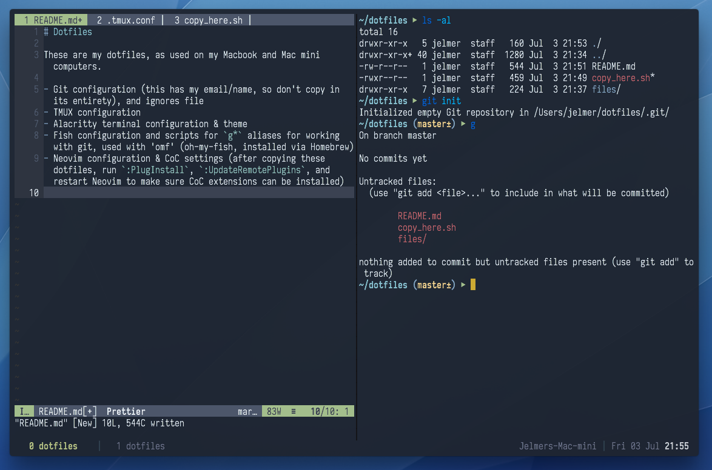

# Dotfiles

These are my dotfiles, as used on my Macbook and Mac mini computers.

- Git configuration (this has my email/name, so don't copy in its entirety), and ignores file
- TMUX configuration
- Alacritty terminal configuration & theme
- Fish configuration and scripts for `g*` aliases for working with git, used with 'omf' (oh-my-fish, installed via Homebrew)
- Neovim configuration & CoC settings (after copying these dotfiles, run `:PlugInstall`, `:UpdateRemotePlugins`, and restart Neovim to make sure CoC extensions can be installed)

Obligatory screenshot:

